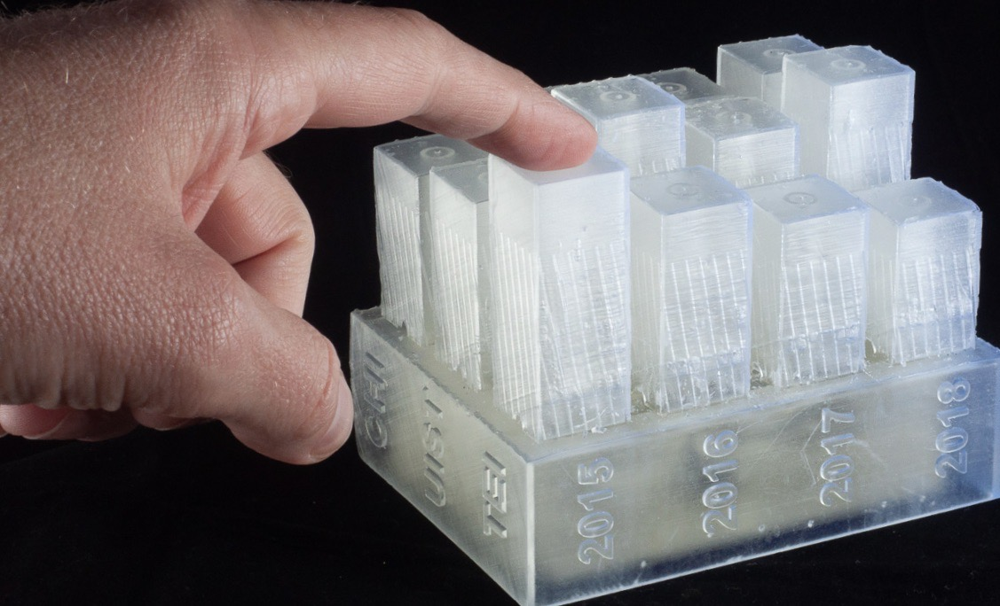
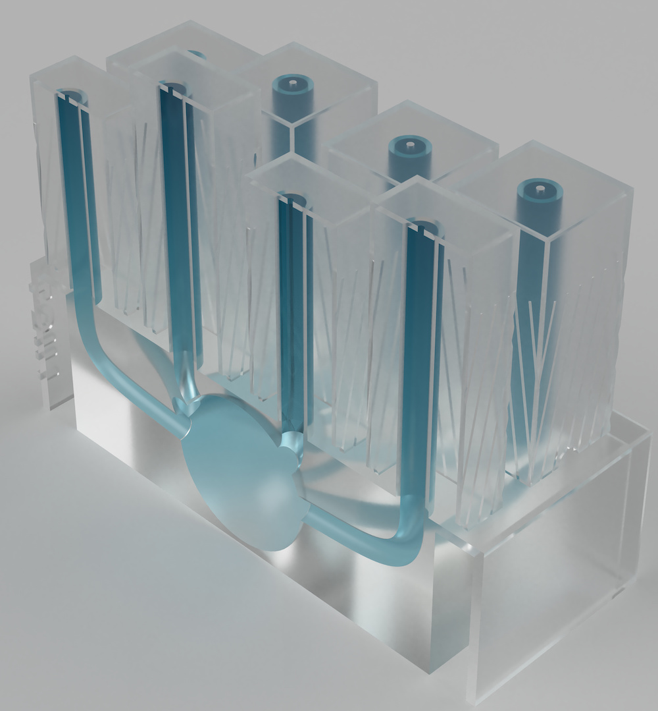

<h2>AirTouch: 3D-printed Touch-Sensitive Objects Using Pneumatic Sensing</h2>

### Abstract

3D printing technology can be used to rapidly prototype the look and feel of 3D objects. However, the objects produced are passive. There has been increasing interest in making these objects *interactive*, yet they often require assembling components or complex calibration. In this paper, we contribute *AirTouch*, a technique that enables designers to fabricate touch-sensitive objects with minimal assembly and calibration using pneumatic sensing. AirTouch-enabled objects are 3D printed as a single structure using a consumer-level 3D printer. AirTouch uses pre-trained machine learning models to identify interactions with fabricated objects, meaning that there is no calibration required once the object has completed printing. We evaluate our technique using fabricated objects with various geometries and touch sensitive locations, obtaining accuracies of at least 90% with 12 interactive locations.

### Working Principle

AirTouch makes use of some principles of fluid dynamics. First, the *principle of continuity*—which says that the total flow entering a system must equate the total flow exiting it—and Bernoulli's principle, which relates flow and pressure. Combining these concepts predict that by modifying the discharge area in a system, the pressure should vary in response.

#### Internal Structure

Using these concepts, we designed an internal structure for AirTouch-enabled objects to distribute incoming airflow from an air compressor to outlets on the object's surface. This structure consists of several components:  a central flow-distribution chamber which supplies all tubes with air; an inlet via which the air source provides pressurized air flow to the flow-distribution chamber; a connection point for the pressure sensor; a series of tubes that connect the flow-distribution chamber to touch locations on the object's surface. By using this structure in all AirTouch-augmented objects, we ensure that the pressure increases when touching the same outlet are comparable, regardless to the outer geometry of the augmented object.

### Repository Overview

In this repository you will find the essential information to get started with AirTouch. You can find the academic paper [here](https://www.carlosetejada.com/s/airtouch.pdf) for more details, various three-dimensional [models](assets/models) of AirTouch-augments objects, experimental [source code](src) for applications, and various [multimedia assets](assets/media).